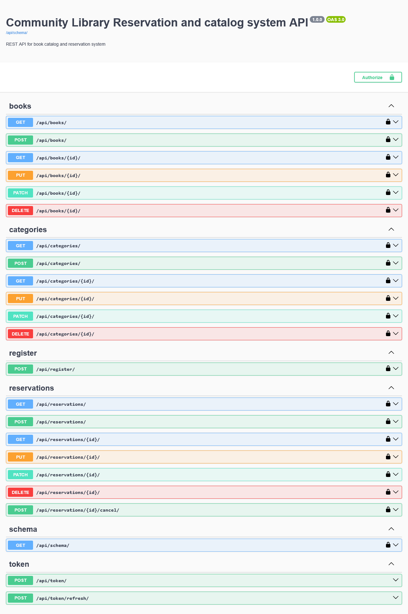
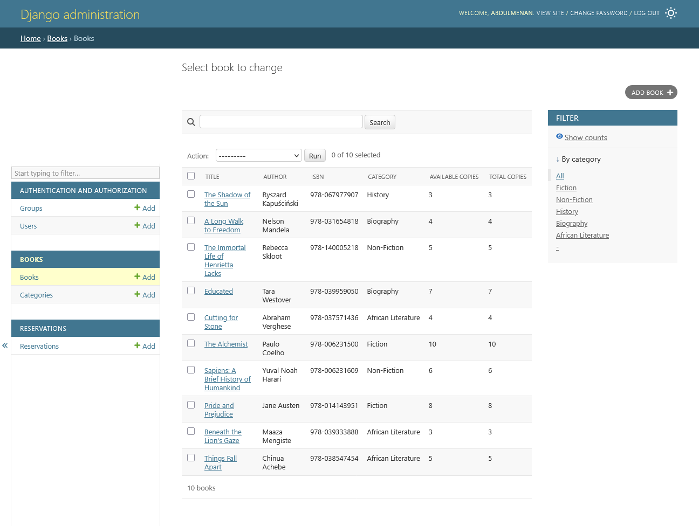

# Community Library Catalog & Reservation System


A **RESTful API** built with Django and Django REST Framework for managing a community library reservation and catalog. Users can browse and search the book catalog, while authenticated users can reserve books. If a book is unavailable, users are added to a queue and automatically promoted when copies become available.

This is my **ALX Back-End development Capstone Project**.

## Features

- **User Authentication**: JWT-based login (using `djangorestframework-simplejwt`)
- **Book Catalog**:
  - Search books by title, author, or ISBN
  - Filter by category
  - Admin CRUD for books and categories
- **Reservation System**:
  - Reserve an available book (decrements available copies)
  - Automatic queuing when no copies are available
  - Queue position tracking
  - Cancel reservation → promotes next user in queue if applicable
- **Interactive API Documentation**: Swagger UI powered by `drf-spectacular`
- **Testing**: Basic unit tests for reservation logic (creation, queuing, cancelling with promotion).
- **Admin Panel**: Full Django admin interface for managing data

## Tech Stack

- **Backend**: Django, Django REST Framework
- **Authentication**: SimpleJWT
- **API Documentation**: drf-spectacular
- **Database**: PostgreSQL (production) / SQLite (development).
- **Filtering & Search**: Django Filter, SearchFilter, OrderingFilter

## Core Entities

- **Category**: Simple model for book genres (e.g., Fiction, African Literature).
- **Book**: Includes title, author, ISBN, category, total_copies, available_copies, cover_image_url.
- **Reservation**: Links user and book, with status (reserved, queued, cancelled, returned), queue_position (for queued only), reserved_at timestamp.

## Project Structure
  - library_reservation_and_catalog_system/
  - ├── books/                  # Book and Category models, serializers, views
  - ├── reservations/           # Reservation model with queue logic
  - ├── users/
  - ├── library_reservation_and_catalog_system/
  - │   ├── settings.py
  - │   ├── urls.py             # Main router and JWT endpoints
  - │   └── ...
  - ├── manage.py
  - └── db.sqlite3              # Development database

## Installation & Setup

1. **Clone the repository**
   ```bash
   git clone https://github.com/YOUR_USERNAME/library-reservation-and-catalog-system.git
   cd library-reservation-and-catalog-system

2. **Create a virtual environment**
   ```bash
   python -m venv venv
   source venv/bin/activate    # Linux/Mac # or
   venv\Scripts\activate       # Windows

3. **Install dependencies**
   ```bash
    pip install -r requirements.txt
(If no requirements.txt yet, install manually:)

    pip install django djangorestframework djangorestframework-simplejwt drf-spectacular django-filter
4. **Run migrations**
   ```bash
    python manage.py makemigrations
    python manage.py migrate
5. **Create a superuser (for admin access)**
   ```bash
    python manage.py createsuperuser
6. **Run the development server**
   ```bash
    python manage.py runserver

## Usage

- Admin Panel: http://127.0.0.1:8000/admin/ → Add categories, books, and view reservations
- API Documentation (Swagger UI): http://127.0.0.1:8000/api/docs/
- Key Endpoints:
    - POST /api/token/ → Get JWT token
    - GET /api/books/ → List and search books
    - GET /api/categories/ → List categories (admin only for CRUD)
    - POST /api/reservations/ → Create reservation (handles reserve/queue)
    - POST /api/reservations/{id}/cancel/ → Cancel reservation
    - POST /api/register/ – allows new users to create accounts (username, email, password)

## Sample Data
The admin panel is pre-seeded with real books (e.g., Things Fall Apart, Beneath the Lion's Gaze, Sapiens) across categories like Fiction, African Literature, and Non-Fiction for easy testing.

## Screenshots

*Interactive API docs via Swagger*


*Django admin managing books*


## License
MIT License – free to use, modify, and distribute.

## Author
Abdulmenan Amin
ALX Africa Back-End Development Student
